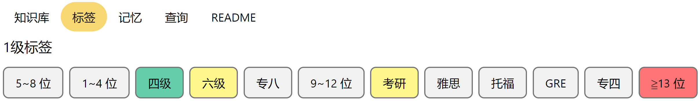
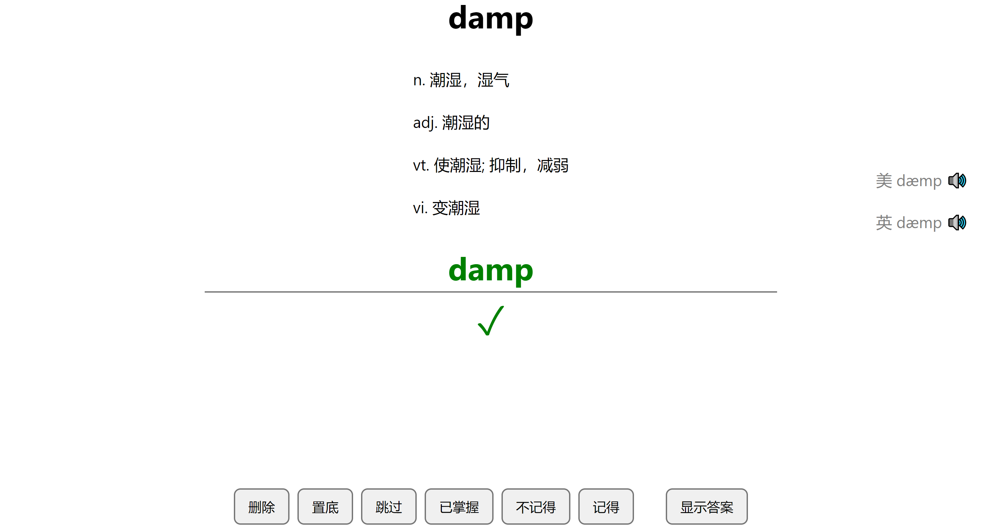

# 软件介绍

CoolMemory-English 是一个免费的记单词软件，它在传统的记单词方式（听、说、读、写）之外提供了一种新的方式：敲。

在该软件界面中，用户需要根据单词的中文释义，在输入区键入单词，系统会实时提示输入的正确与否，并根据学习者的表现智能安排该单词下一次出现的时机。

当前版本：v1.0

# 作者

[江南雨上](mailto:lcctoor@outlook.com)

[主页](https://lcctoor.github.io/arts/) \| [Github](https://github.com/lcctoor) \| [PyPi](https://pypi.org/user/lcctoor) \| [微信](https://lcctoor.github.io/arts/arts/ip_static/WeChatQRC.jpg) \| [邮箱](mailto:lcctoor@outlook.com)

# 下载地址

* [OneDrive](https://1drv.ms/f/s!AvKC1LvuVvx_gVZttKv6md5tgnOB) / Release / CoolMemory-English / v1.0 -binary -20231211.zip
* [百度网盘](https://pan.baidu.com/s/1FaAz83Ima2uNE_I6Q9TDQg?pwd=nqt8)（提取码：nqt8） / Release / CoolMemory-English / v1.0 -binary -20231211.zip

# 理论基础

* **专注**

  我们能否高效记住一个单词，很大程度上取决于学习时的专注力，我们的大脑在专注时最能有效地进行信息编码和记忆。因此，当我们在学习单词时，专注力非常关键。当一个学习者在敲击单词的按键时，他基本上是专注的，因为人很难心里想着 A 手却能按或者写出 B，比如，即使像黄蓉这么聪明的人，也仍然无法做到左右互搏。
* **肌肉记忆**

  敲击按键比写字更能利用肌肉记忆。当人们写字时，实际上只有大拇指、食指、中指这三个手指的肌肉动作是比较有辨识度的，然而尽管如此，受限于纸张和字号的大小，这三个最有辨识度的手指摆动幅度仍然很小。这些因素导致人们很难通过写字时的肌肉记忆来记住单词。

  而当人们敲击键盘时，他利用了八个手指在键盘上进行协作，相对于写字，原本由三个手指负责的（肌肉记忆）任务获得了其余五根手指的支援，肌肉记忆效率变成原来的 2.67 倍。不仅如此，相对于写字方式中手指的小幅摆动，由于按键分布面积大，手指在键盘上大开大合，这种对手指动作的深刻感知更是对肌肉记忆效率有很大的加成。
* **体力**

  由于敲击键盘所消耗的能量远比写（端正的）字低，可以使学习者维持更长的良好学习状态。
* **健康**

  当人们长时间伏案写字时，很容易产生身体上的不适，甚至引发疾病。而使用敲击按键的方式时，则可以抬头挺胸地进行，这对维持身体健康非常重要。
* **由即时反馈引发的快乐**

  当我们使用 CoolMemory-English 学习时，对于每一个键入，无论正确与否，系统都会立即给予反馈（正确的显示黑色字，错误的显示红色字，答对时显示绿色字），对这种即时反馈的感知可以引发我们的身体分泌多巴胺，使我们在学习中感受到快乐，进而真正把学习当成一种乐趣。

# 使用教程 ([查看演示](ip_static/使用演示.mp4) 👈)

### 知识库页面

<p align="center"></p>

在此页面选择至少 1 个知识库（可多选，如果不同的知识库中有相同的单词，程序会自动去重）。

### 标签页面

<p align="center"></p>

如果在第 1 步中有选择了至少 1 个知识库，则在标签页面便会显示出相应单词的所有标签。

每个标签都有 4 种颜色状态，可点击具体标签进行切换状态。这些状态的区别如下：

|     颜色     | 含义                                                                                           |
| :----------: | ---------------------------------------------------------------------------------------------- |
|     绿色     | 表示必要，如果一个单词不包含该标签，则这个单词不会出现在记忆页面                               |
|     红色     | 表示排除，如果一个单词包含该标签，则这个单词不会出现在记忆页面                                 |
|     黄色     | 所有黄色标签视为一个整体，如果一个单词的标签与这些黄色标签无交集，则这个单词不会出现在记忆页面 |
| 灰色（默认） | 无论一个单词是否包含该标签，这个单词都有可能出现在记忆页面                                     |

### 记忆页面

<p align="center"></p>

1、首先，将鼠标滑动到屏幕右边缘，此时会出现一个【开始】按钮，点击该按钮，便会出现单词界面。当你中途切换标签的颜色状态后，可以重新点击此按钮，系统会重排词汇。

2、每切换一个单词，都会自动播放该单词的音频。将鼠标滑动到单词界面左侧，会出现一个【自动播放】按钮，点击该按钮，便可切换是否自动播放。

3、你需要根据中文释义在输入框中输入正确的单词，当你输入错误时，单词会显示为红色；修正后，单词会变回黑色；输入完整时，单词会变成绿色。

4、如果你不知道单词的正确拼写，可以点击【显示答案】，接着界面便会显示出答案。

5、以下反馈按钮在作用效果上的区别：

| 按钮   | 作用效果                                                                         |
| ------ | -------------------------------------------------------------------------------- |
| 记得   | 告诉系统你记得该单词，系统会智能安排此单词后续出现的时机                         |
| 不记得 | 告诉系统你不记得该单词，系统会智能安排此单词后续出现的时机                       |
| 删除   | 该单词将永远不会再出现                                                           |
| 已掌握 | 告诉系统你已经掌握了该单词，系统会将此单词放到队列末尾，并智能安排后续出现的时机 |
| 置底   | 系统会将此单词放到队列末尾，并且以后每次启动 APP 时都会将该单词放到队列末尾      |
| 跳过   | 系统会将此单词放到队列末尾，但下次启动 APP 时又会智能排序此单词的位置            |

6、数字键 0 ~ 9 的功能：

| 按键 | 功能     |
| :--: | -------- |
|  1  | 删除     |
|  2  | 置底     |
|  3  | 跳过     |
|  4  | 已掌握   |
|  5  | 不记得   |
|  6  | 记得     |
|  7  | 显示答案 |
|  8  | /        |
|  9  | 发出美音 |
|  0  | 发出英音 |

7、回车键：

**你可以忽略繁多的反馈按钮和数字按键，始终只按回车键，系统会自动判断你的意图是【显示答案】、【记得】、【不记得】中的哪一个。**

# 导入自定义词库

我们以具体示例来教学如何导入自定义词库，以导入单词 abandon 为例：

1、在 settings/words/ 目录下创建一个名为 abandon.row 的文件夹。

2、在 abandon.row/ 下创建一个名为 row.files 的文件夹。

3、在 row.files/ 下放置 3 个文件：

| 文件名       | 说明               |
| ------------ | ------------------ |
| mei.mp3      | 美式发音的音频文件 |
| ying.mp3     | 英式发音的音频文件 |
| meanings.txt | 中文释义的文本文件 |

4、在 abandon.row/ 下创建一个名为 row.txt 的 JSON 文档，格式如下：

```json
{
    "psy-us": "ə'bændən",
    "psy-uk": "ə'bændən",
    "tagtree": { "四级": {} },
    "order": 1000
}
```

各字段的含义如下：

| 字段                | 含义                                   |
| ------------------- | -------------------------------------- |
| psy-us              | 美式音标                               |
| psy-uk              | 英式音标                               |
| order（可选字段）   | 该单词在词库中的初始排序               |
| tagtree（可选字段） | 单词的分级标签，其键为字符串，值为字典 |

# 口语

当你使用 CoolMemory-English 学单词时，我们不建议你每出现一个单词，就模仿它的发音去朗读。我们建议你：**用耳朵去听就好。**因为我们认为：人们能否准确朗读一个单词，最重要的因素并不是读了多少遍，而是听了多少遍。**你只有听准了，才能读准**，而你只要听准了，想读准就不难了。

当一个单词多次出现后，由于每次出现时都会自动播放一遍发音，听的次数多了，你自然就懂得如何读它了。

# 捐赠

CoolMemory-English 是一个免费的英语学习软件，由我个人开发和维护，如果它对您有帮助，希望您能给予一些支持！

每一份微小的支持，都将帮助保持车轮完美旋转！

<p align="center"></p>

# 开源软件声明

本产品所使用的第三方软件包列表：

| 软件包                                             | 许可证                                                              |
| -------------------------------------------------- | ------------------------------------------------------------------- |
| [Python](https://www.python.org)                      | [Python Software Foundation License](licenses/licenses/Python/LICENSE) |
| [Chromium](https://www.chromium.org)                  | [License](licenses/licenses/Chromium/LICENSE)                          |
| [pyppeteer](https://pypi.org/project/pyppeteer)       | [MIT License](licenses/licenses/pyppeteer/LICENSE)                     |
| [tornado](https://pypi.org/project/tornado)           | [Apache License 2.0](licenses/licenses/tornado/LICENSE)                |
| [Nuitka](https://pypi.org/project/nuitka)             | [Apache License 2.0](licenses/licenses/Nuitka/LICENSE)                 |
| [pycryptodome](https://pypi.org/project/pycryptodome) | [BSD 2-Clause License](licenses/licenses/pycryptodome/LICENSE)         |

感谢这些开源项目的贡献！
